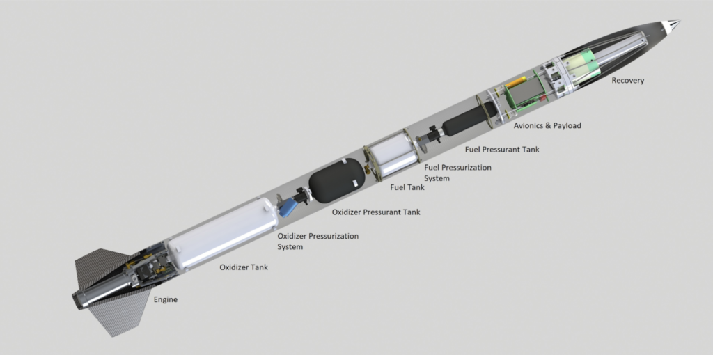

# µHoubolt
µHoubolt (µHb for short) is an Ethanol/N2O liquid rocket sucessfully flown at EuRoC 2022. It is capable of reaching an altitude of 3km with a 1kg payload, with a lift-off mass of only 12kg and a length of 2m.

It is designed to be relatively easy and affordable to build by using COTS components with good availability and simple custom parts that can be ordered from various manufacturers or made mostly in house using basic manual hand and machine tools and a 3D printer.

To enable others to benefit from our developments, and maybe even base their own rocket design on µHoubolt, all ressources are released publicly.
To encurage further sharing of work based on this, licenses that mandate releasing modifications under the same licenses are used for some of the hard- and software. If these don't work for you for whatever reason, please feel free to contact us (email below) and we will find a solution.

This repository serves as an overview, containing some project ressources and linking to many others.

In case of any questions, please feel free to contact [uhb@spaceteam.at](mailto:uhb@spaceteam.at).

## Ressources
While unfortunately these ressources are for a large part not very well organized, documented or complete (sorry!), they should contain everything needed to replicate this project. In case something relevant appears to be missing, please contact us.

### Documentation
- [Website](https://spaceteam.at/uhb)
- [Technical Report](TechnicalReport_EuRoC2022.pdf) and [LaTeX sources](TechnicalReport_EuRoC2022_Sources)
- [Launch Procedures](µHoubolt_Launch_Procedures.pdf) and [LaTeX sources](µHoubolt_Launch_Procedures_Sources)
- [BOM](BOM) (Incomplete)
- [EuRoC 2022 Flight Report](FlightReport_EuRoC2022.pdf)
- [EuRoC 2022 Flight Data](FlightData_EuRoC2022)
- [Images](Images/) A selection of pictures showing manufacturing, testing and launching.
- [Engine Testing & Launch Video Compilation](https://youtu.be/bNNrGTRMqmY)

### Simulation
- [OpenRocket Liquid Engine Generator](https://github.com/SpaceTeam/ORLEG)
- [OpenRocket Simulation](Simulation_OpenRocket)

### Mechanical
- [Rocket CAD](https://github.com/SpaceTeam/uHoubolt_CAD)
- [Nosecone & Fincan Manufacturing](CompositeManufacturing.pdf)

### Electronics
- [Power Management Unit KiCAD Project](https://github.com/SpaceTeam/uHoubolt_PCB_PMU)
- [LiIon Charger KiCAD Project](https://github.com/SpaceTeam/uHoubolt_PCB_LiIon_Charger)
- [Radio Communication Unit KiCAD Project](https://github.com/SpaceTeam/uHoubolt_PCB_RCU)
- [Engine Control Unit KiCAD Project](https://github.com/SpaceTeam/uHoubolt_PCB_ECU)
- [KiCAD Library](https://github.com/SpaceTeam/TXV_Library_PCB) All custom footprints and symbols of the Liquids projects should be included into this repositry.

### Firmware & Software
- [Space Team Rocket Hardware Abstraction Layer](https://github.com/SpaceTeam/STRHAL) (in active development for later projects)
- [RCU / PMU / ECU Firmware](https://github.com/SpaceTeam/firmware_liquids) (in active development for later projects)
- [CAN Protocol](https://github.com/SpaceTeam/can_houbolt)
- [ECUI Web](https://github.com/SpaceTeam/web_ecui_houbolt) (in active development for later projects) The Web ECUI is a browser based user interface for our mission control. The repository contains the web server for hosting it on a machine (the same as the LLServer is running on). The ECUI can also embed PnIDs, the code for which is in another repository. Configuration is done via JSON files and pre-set configs for our various projects is stored in the config_ecui repository.
- [ECUI LL](https://github.com/SpaceTeam/llserver_ecui_houbolt) (in active development for later projects) The Low-Level Server is a C++ server which handles incoming data from the Hardware via CAN-FD, talks to the Web based user interface and feeds the InfluxDB database and Grafana. Configuration is done via JSON files and pre-set configs for our various projects is stored in the config_ecui repository.
- [ECUI PnID](https://github.com/SpaceTeam/pnid_houbolt) (in active development for later projects) The PnID can be run standalone or embedded within the ECUI. It loosely follows symbol standards for PnIDs from the industry, but is extended with symbols we need that don't really exist otherwise. The PnIDs are created in KiCad and then converted to HTML svg elements using a JavaScript based converter (which is also contained in this repository). The converter only supports KiCad 5 schematic/library combinations. Similar to the Web ECUI the configuration is done using JSON files, while pre-set configs for our various projects (including KiCad schematic files for the PnID conversion and behaviour configs) are contained in the config_ecui repository. The PnID symbol library for KiCad is contained in the PnID-Lib repository as this makes it better shareable and extensible between projects within Space Team.
- [ECUI Theming](https://github.com/SpaceTeam/SpaceTeamTheme) The Space Team Theme is a set of CSS variables for both a light and dark theme that is supposed to be able to be used in all (web based) projects for Space Team. This allows different projects of Space Team to have a more coherent and similar look while offloading tedious things like colour choice and contrast checking from each individual project. It was originally developed to decouple theming (as in, colour choice) from the actual CSS of the PnID/ECUI, but expanded upon to be able to be easily imported in other projects with minimal setup to switch out color palettes on the fly and create a (somewhat) solid theming foundation. As of writing (2022-08-02) this is still very much a work in progress, as it's neither well made nor that easy to include and is currently very much µHoubolt/ECUI centered in code structure and UI choices for the included theme switcher.
- [ECUI Config](https://github.com/SpaceTeam/config_ecui) (uHoubolt branch) The Config ECUI repo contains all relevant configuration and working files to run an instance of ECUI with an embedded PnID (aka: one full instance of our mission control) as well as the LLServer. To set up the interface for a different project (eg: switch from µHoubolt to Franz) different branches are used. Switching the branch in the config ecui and restarting LLServer and Web ECUI web server is sufficient to completely switch to all necessary setup of that other project.
- [PnID KiCAD library](https://github.com/SpaceTeam/pnid-lib) The PnID KiCad lib contains many symbols ready to be used in our PnIDs with their needed data fields and all.

## Known Issues
Some of the ressources linked above contain known issues spcific to them. The others are listed here in no particular order.
- Documentation & procedures insufficient
- Fill system vent not great (?)
- Almost no load (or other) calculations/simulations done (officials at launch events don't like that)
- Engine efficiency inconsistent over multiple manufactured parts, injector design probably quite susceptible to tolerances
- COTS linecutters for recovery are expensive
- Oxidizer fill valve leak (see flight report)
- Drogue a little too small, large main shock
- One piece cotton phenolic chamber abalates quickly and manufacturing is time consuming. A graphite nozzle and phenolic cotton/paper chamber liner would probably be better.
- Cable management not that good
- Lift-off velocity quite low, safe but quite susceptible to wind, EuRoC officials unhappy
- Launch pad oxidizer bottle installation difficult and unsafe
- Recovery lines rub against corners and need tape protection
- Eggtimer TRS mounting not great
- Launch pad oxidizer bottle temperature management difficult in hot weather
- Propulsion system transport and installation annoying due to fuel system not being structurally connected
- Threads in thin aluminium strip easily
- Fuel fill screw connection annoying
- Fuel fill syringe heavy to operate
- Cameras positioned too far inwards, require large cutouts in body tube
- Accessing avionics requires too much disassembly
- Umbilical connection not robust
- Battery charging via umbilical not working
- Battery capacity too low to support EuRoC required standby time if charging on launch rail doesn't work
- GNSS reception marginal when fully assembled
- Recovery shock absorbers worked well but need more testing & characterization
- Igniter breech PTFE seals annoying, elastomer o-rings would probably be better
- Igniter manufacturing inconsistent and dependent on experience
- Umbilical decoupling not reliable enough
- In the CAD, the fincan is too long and extends beyond the engine. In reality that is not the case, as can be seen on pictures.
